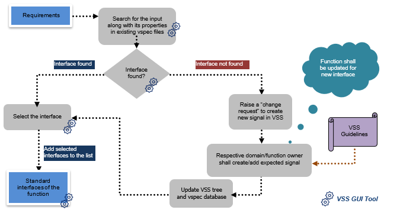
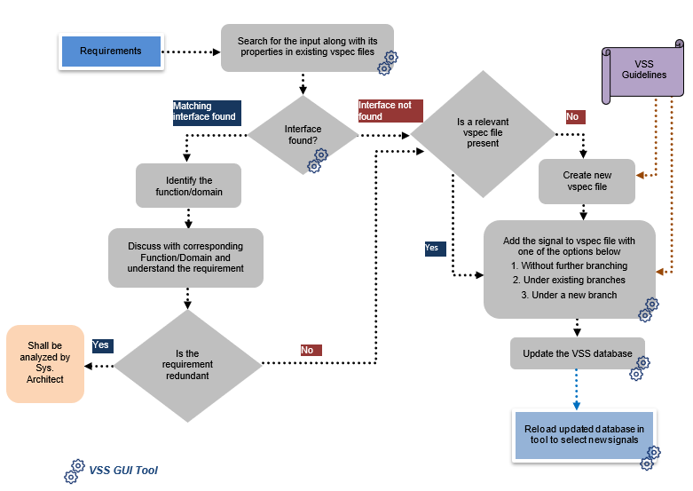

# Introduction
To allow easier integration and re-usable data elements, it is necessary to establish a standard that allows easier and efficient exchange of data. 
Here, we adopt the Vehicle Signal Specification (VSS) introduced by the Connected Vehicle Systems Alliance (COVESA). 
It is an industry relevant data standard developed as part of the Connected Vehicle Interface Initiative (CVII), a collaboration between COVESA and World Wide Web Consortium (W3C). 
It is currently a global OEM-led joint development. 
Though, the main aim of the VSS is to provide standard interfaces between vehicle and cloud, here VSS is extended to provide a standard definition of the data elements that are exchanged between software components (SWCs). 

# Process overview
Process to be followed with respect to the input interfaces of an application. 

Process to be followed with respect to the output interfaces of an application. 
