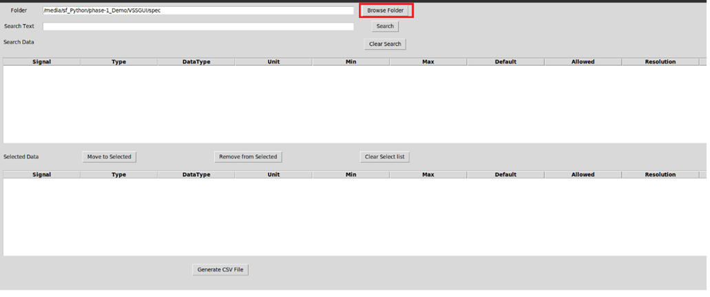
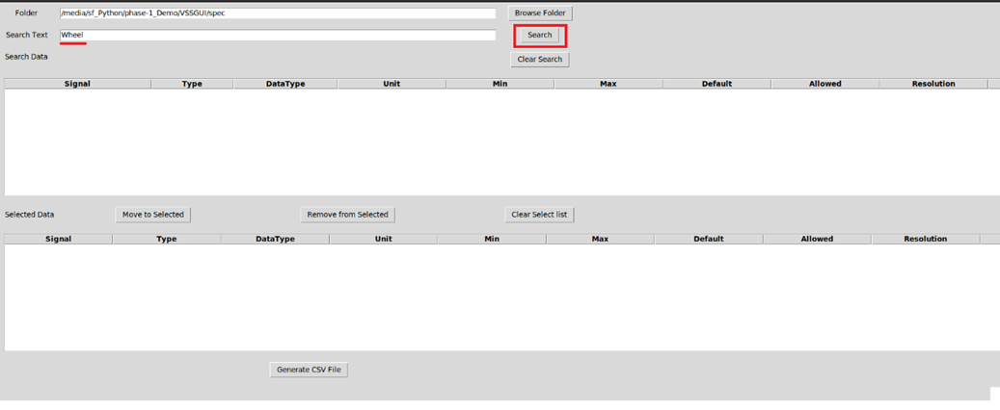
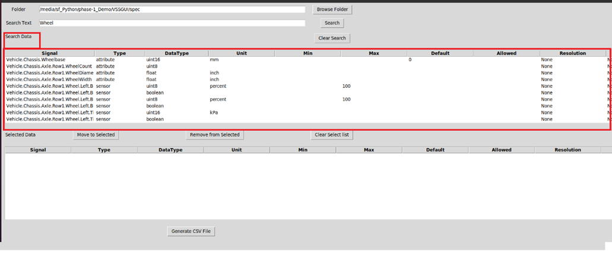
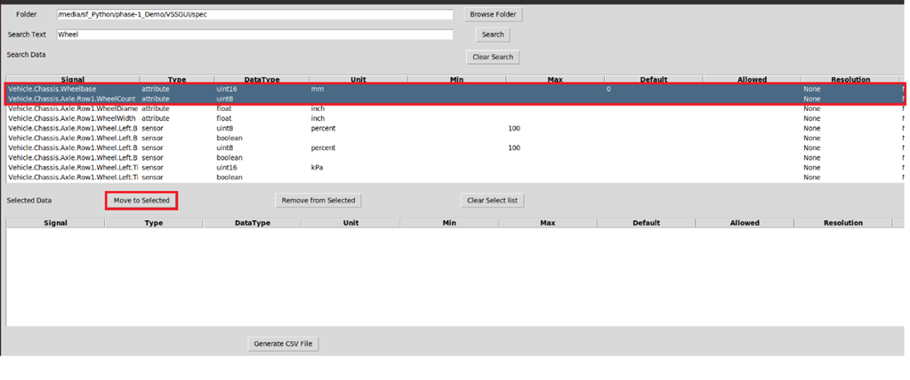
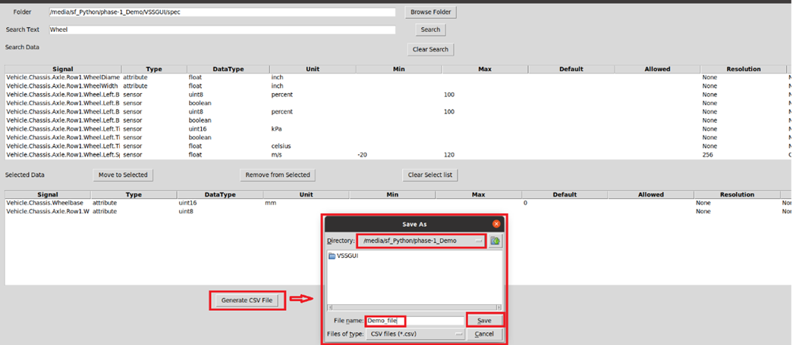
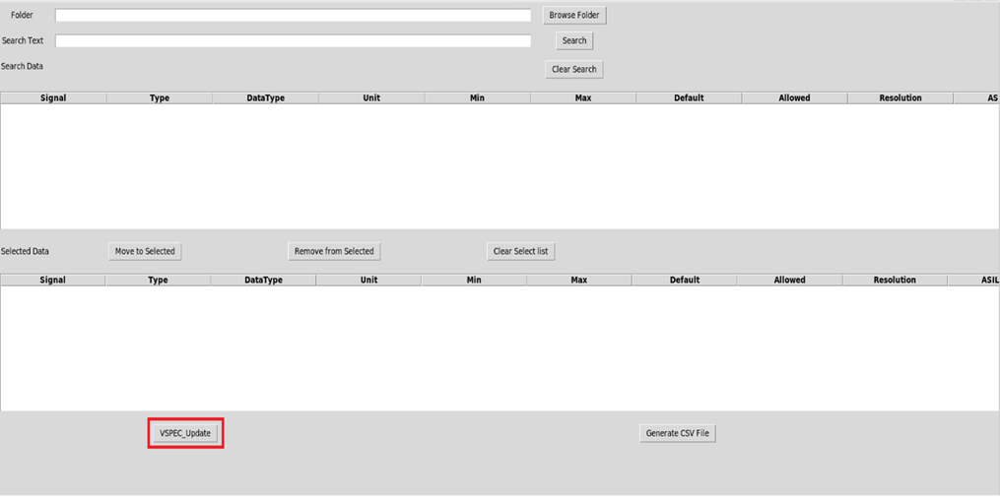
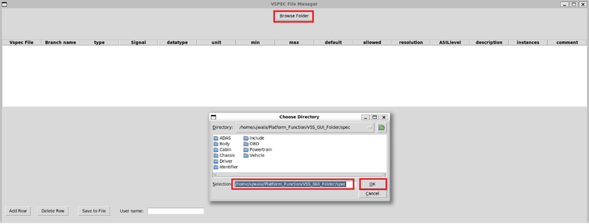
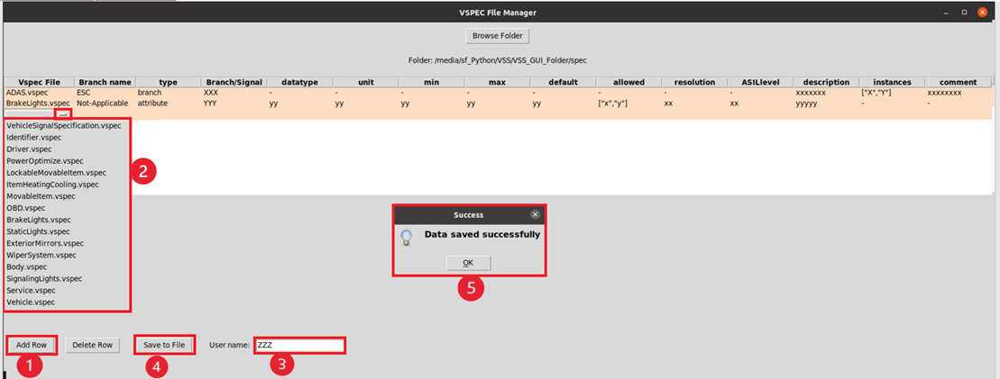

# Steps to use the GUI tool 
Execute the Python `vss_gui.py` script.

## Signal selection 
1. Provide the path for .vspec files `scripts\vss\vspec` through the *Browse Folder* button. 

2. Search for the required signal in *Search* button. 

3. List of all signals that match the search criteria are listed in the *Search Data* pane along with the respective attributes. 

4. Select the required signals and move them to *Selected Data* pane by clicking the *Move to Selected* button. 

5. Similarly select the other required signals for the application and generate the .csv file by clicking the *Generate CSV File* button. 

## Signal creation 
1. To create a new signal, select the *VSPEC_Update* button. 

2. *VSPEC File Manager* window will be opened and select the spec folder path to be updated using the *Browse Folder* button. 

3. Add signal/branch by selecting the *Add Row* button. It is necessary to select branch, type, and the relevant attributes of the signal. Provide also the username to save the data into files. 
